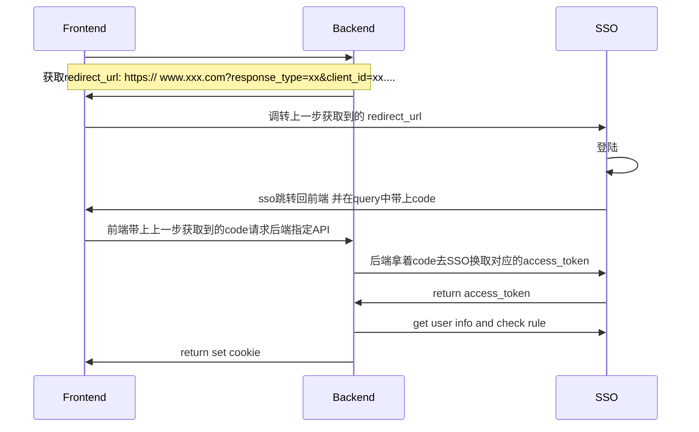

# bazaar

```mermaid
sequenceDiagram
  participant Frontend
  participant Backend
  participant SSO
  Frontend->>Backend: 
  note over Frontend, Backend : 获取redirect_url: https:// www.xxx.com?response_type=xx&client_id=xx....
  Backend->>Frontend: 
  Frontend->>SSO: 调转上一步获取到的 redirect_url
  SSO->>SSO: 登陆
  SSO->>Frontend: sso跳转回前端 并在query中带上code
  Frontend->>Backend: 前端带上上一步获取到的code请求后端指定API
  Backend->>SSO: 后端拿着code去SSO换取对应的access_token
  SSO->>Backend: return access_token
  Backend->>SSO: get user info and check rule
  Backend->>Frontend: return set cookie
```